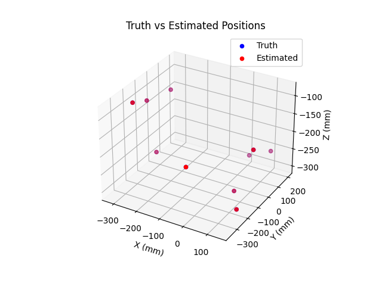
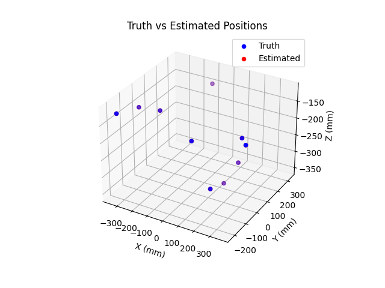

# Six-Degree-of-Freedom Localization for Magnetic Capsule Endoscopy

## Introduction

This project implements the localization method described in the paper "Six-Degree-of-Freedom Localization With a 3-Axis Accelerometer and a 2-Axis Magnetometer for Magnetic Capsule Endoscopy" by Adam J. Sperry, Jordan J. Christensen, and Jake J. Abbott. The method provides an accurate estimation of the six-degree-of-freedom pose of a magnetic capsule endoscope using internal sensors, including a 3-axis accelerometer and a 2-axis magnetometer.

## Project Structure

* **`simulator.py`** : This script contains the simulation code that reproduces the results from the paper, including the sensor data generation and pose estimation algorithms.
* **`Six-Degree-of-Freedom_Localization_With_a_3-Axis_Accelerometer_and_a_2-Axis_Magnetometer_for_Magnetic_Capsule_Endoscopy.pdf`** : The original paper describing the localization method.

## Requirements

To run the simulation, ensure you have the following software installed:

* Python 3.7+
* Required Python libraries:
  * numpy
  * scipy
  * matplotlib

You can install the required libraries using the following command:

<pre>

bash
<button class="flex gap-1 items-center"><svg xmlns="http://www.w3.org/2000/svg" width="24" height="24" fill="none" viewBox="0 0 24 24" class="icon-sm"><path fill="currentColor" fill-rule="evenodd" d="M7 5a3 3 0 0 1 3-3h9a3 3 0 0 1 3 3v9a3 3 0 0 1-3 3h-2v2a3 3 0 0 1-3 3H5a3 3 0 0 1-3-3v-9a3 3 0 0 1 3-3h2zm2 2h5a3 3 0 0 1 3 3v5h2a1 1 0 0 0 1-1V5a1 1 0 0 0-1-1h-9a1 1 0 0 0-1 1zM5 9a1 1 0 0 0-1 1v9a1 1 0 0 0 1 1h9a1 1 0 0 0 1-1v-9a1 1 0 0 0-1-1z" clip-rule="evenodd"></path></svg>Copy code</button>

<code class="!whitespace-pre hljs language-bash">pip install numpy scipy matplotlib
</code>

</pre>

## Usage

1. **Clone the repository** :

<pre>

bash
<button class="flex gap-1 items-center"><svg xmlns="http://www.w3.org/2000/svg" width="24" height="24" fill="none" viewBox="0 0 24 24" class="icon-sm"><path fill="currentColor" fill-rule="evenodd" d="M7 5a3 3 0 0 1 3-3h9a3 3 0 0 1 3 3v9a3 3 0 0 1-3 3h-2v2a3 3 0 0 1-3 3H5a3 3 0 0 1-3-3v-9a3 3 0 0 1 3-3h2zm2 2h5a3 3 0 0 1 3 3v5h2a1 1 0 0 0 1-1V5a1 1 0 0 0-1-1h-9a1 1 0 0 0-1 1zM5 9a1 1 0 0 0-1 1v9a1 1 0 0 0 1 1h9a1 1 0 0 0 1-1v-9a1 1 0 0 0-1-1z" clip-rule="evenodd"></path></svg>Copy code</button>

<code class="!whitespace-pre hljs language-bash">git clone https://github.com/yourusername/6DOF-Localization.git
   cd 6DOF-Localization
   </code>

</pre>

1. **Run the simulation** :

<pre>

bash
<button class="flex gap-1 items-center"><svg xmlns="http://www.w3.org/2000/svg" width="24" height="24" fill="none" viewBox="0 0 24 24" class="icon-sm"><path fill="currentColor" fill-rule="evenodd" d="M7 5a3 3 0 0 1 3-3h9a3 3 0 0 1 3 3v9a3 3 0 0 1-3 3h-2v2a3 3 0 0 1-3 3H5a3 3 0 0 1-3-3v-9a3 3 0 0 1 3-3h2zm2 2h5a3 3 0 0 1 3 3v5h2a1 1 0 0 0 1-1V5a1 1 0 0 0-1-1h-9a1 1 0 0 0-1 1zM5 9a1 1 0 0 0-1 1v9a1 1 0 0 0 1 1h9a1 1 0 0 0 1-1v-9a1 1 0 0 0-1-1z" clip-rule="evenodd"></path></svg>Copy code</button>

<code class="!whitespace-pre hljs language-bash">python simulator.py
   </code>

</pre>

   The script will generate simulated sensor data and estimate the capsule's pose using the method described in the paper. It will also visualize the results.

## Simulation Details

The simulation includes the following steps:

1. **Sensor Data Generation** : Simulates the accelerometer and magnetometer data based on predefined capsule movements and external magnetic fields.
2. **Pose Estimation** : Uses the Levenberg-Marquardt algorithm to estimate the capsule's position and orientation from the sensor data.
3. **Error Analysis** : Compares the estimated pose with the true pose and computes the localization error.

## Method Overview

The localization method relies on:

* A 3-axis accelerometer to measure the direction of gravity.
* A 2-axis magnetometer to measure the magnetic field along two cardinal axes.
* An external magnetic dipole with known strength and orientation.

The method estimates the capsule's 3-DOF position and 3-DOF orientation by solving a nonlinear least-squares optimization problem using the sensor data and the known properties of the external magnetic field.

## Results

The simulation replicates the results from the paper, demonstrating that the method achieves high localization accuracy with minimal sensor complexity. The results include:

* Localization accuracy comparable to more complex methods.
* Performance in various simulated scenarios to validate robustness.

### Without Noise {without noise}

### With Noise

## References

* Sperry, A. J., Christensen, J. J., & Abbott, J. J. (2022). Six-Degree-of-Freedom Localization With a 3-Axis Accelerometer and a 2-Axis Magnetometer for Magnetic Capsule Endoscopy. IEEE Robotics and Automation Letters, 7(2), 2110-2115.
